## CATBOOMER  

## SCERARIO:
• LAN segment range: 10.5.28.0/24 (10.5.28.0 through 10.5.28.255)  
• Domain: catbomber.net  
• Domain controller: 10.5.28.8 - Catbomber-DC  
• LAN segment gateway: 10.5.28.1  
• LAN segment broadcast address: 10.5.28.255  

## Questions  
### 1. Based on the Trickbot infection's HTTP POST traffic, what is the IP
address, host name, and user account name for the infected Windows
client?

-  IP address: **10.5.28.229**  
-  host name: **Cat-Bomb-W7-PC**  
-  user account name: **phillip.ghent**
   
 Go to STATISTICS > CONVERSATIONS > IPV4 and see the IP Address which appears the most.  
 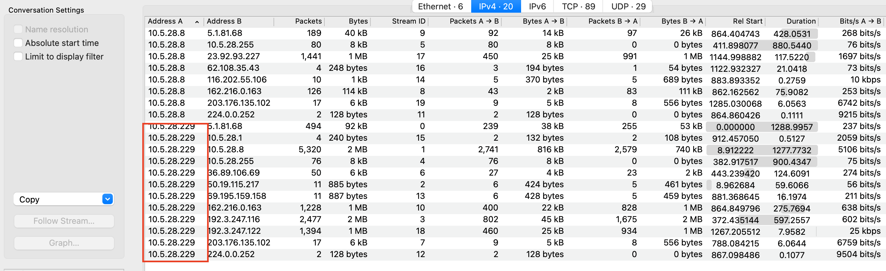  
 
To get the URL and the Host name, use the following filter and follow the TCP Stream: **http.request.uri contains "/90"**  
- **When Trickbot successfully infects a Windows host, it sends an HTTP
POST request with the system data, usually over TCP port 8082. The URL
ends with /90**
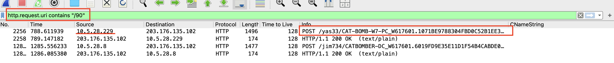
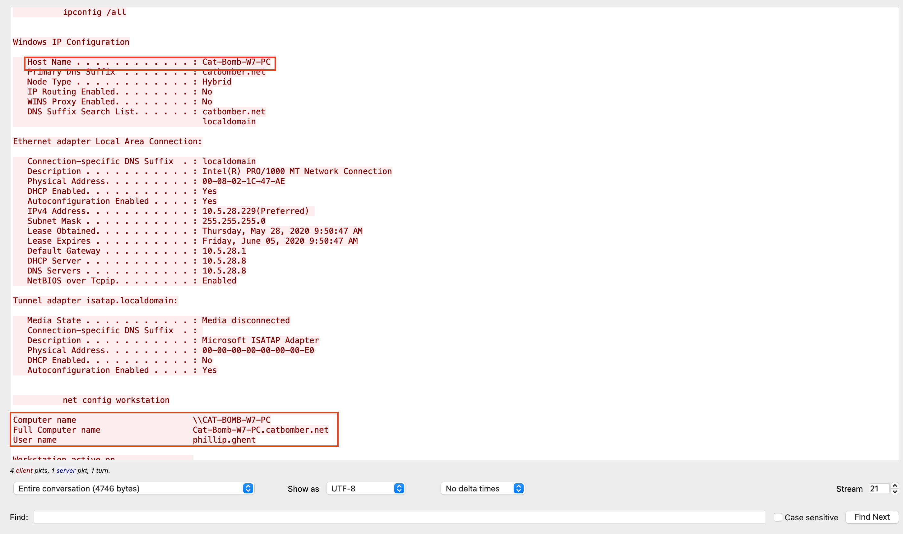 

### 2. What is the other user account name and other Windows client host name
found in the Trickbot HTTP POST traffic?

- Using the same filter as above "/90" URLs,we find other clients under the "---LOCAL_MACHINE_DATA--" section. Scroll down a bit in the TCP stream window to find the host name.  

Other Windows client host name: **CAT-BOMB-W10-PC**  
Other user account name: **timothy.sizemore**
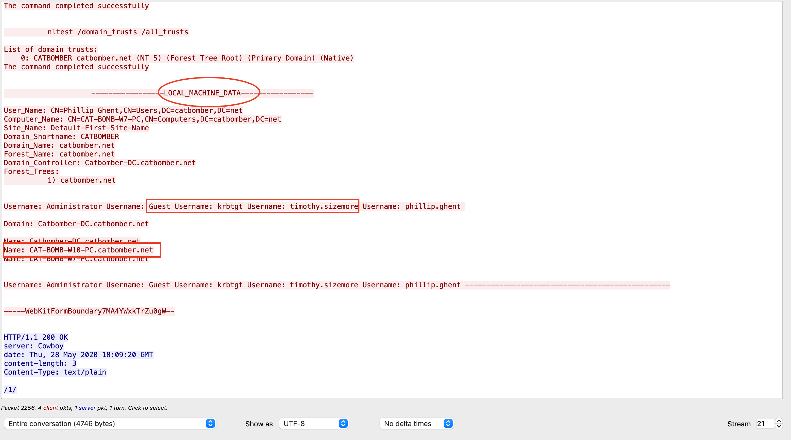  

### 3. What is the infected user's email password?  
**User's email account password: gh3ntf@st**  

Run this filter:  
- frame contains "password" and ip contains "mail" or  
- http.request.method == "POST" and ip contains "mail"  or
- http.request.uri contains "/81" and ip contains "mail",....... to find URL ending in /81 to exfiltrate the PASSWORD.
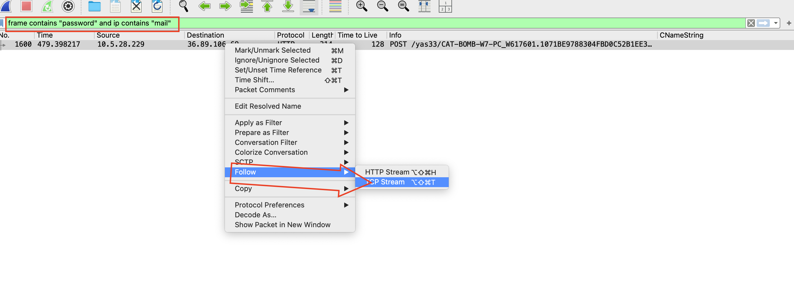
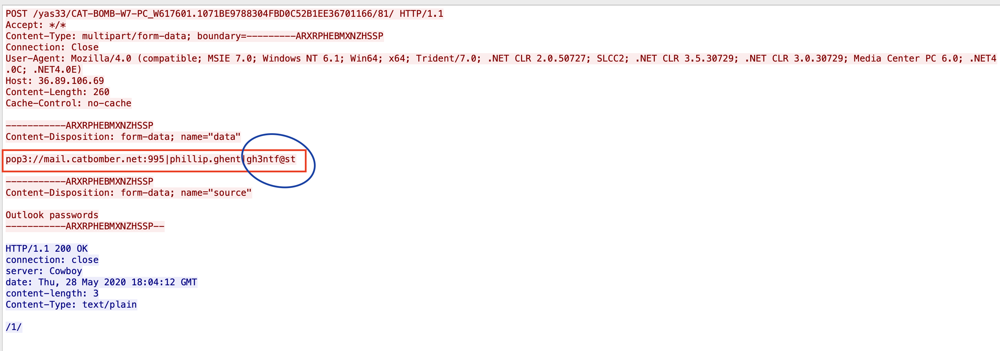

### 4. Two Windows executable files are sent in the network traffic. What are the SHA256 hashes for these files?  

4e76d73f3b303e481036ada80c2eeba8db2f306cbc9323748560843c80b2fed1  
934c84524389ecfb3b1dfcb28f9697a2b52ea0ebcaa510469f0d2d9086bcc79a  

- To find Windows EXE files, use the following filter: **http contains "This program"**. This will return 2 frames in the column display, then follow the TCP Streams to download the files.
  
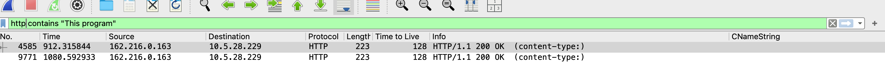

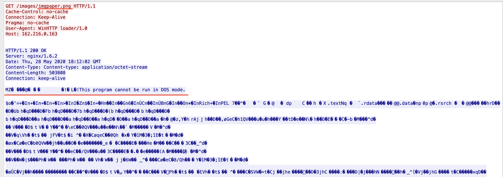  
The first TCP stream shows an EXE file returned from a URL that ends in imgpaper.png.

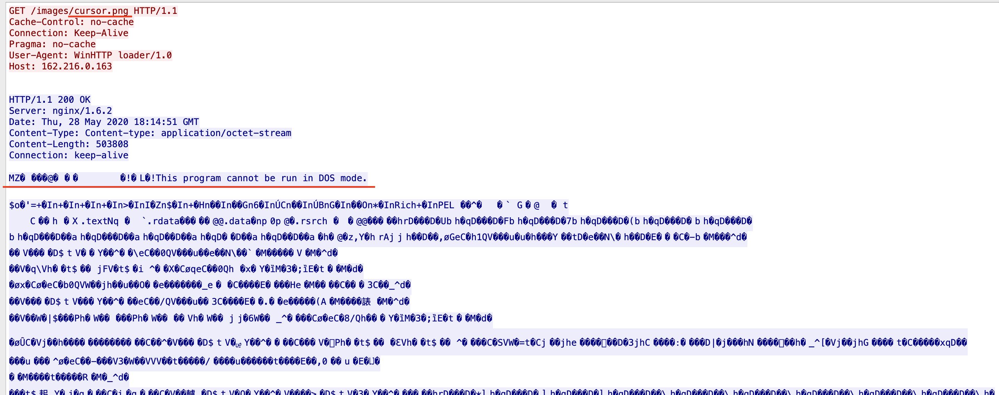    
The second TCP stream shows an EXE file returned from a URL that ends in cursor.png.  

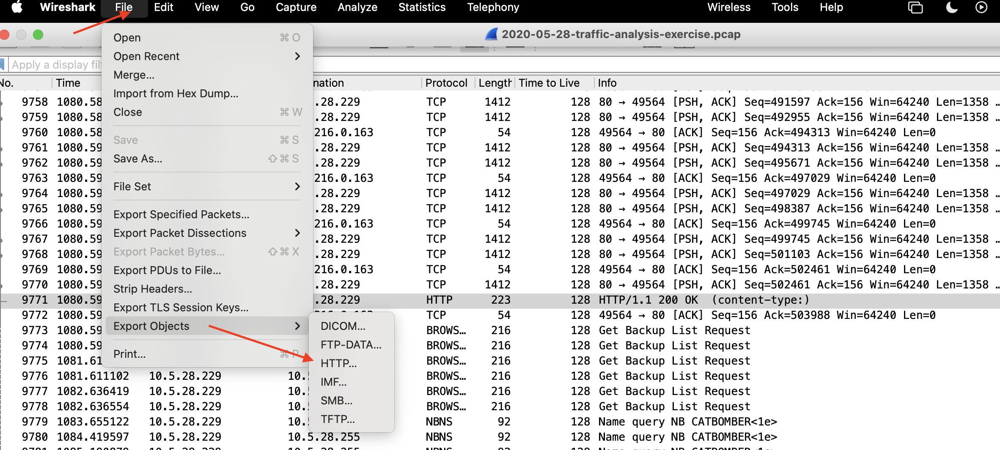  
Exporting HTTP objects from the pcap.  

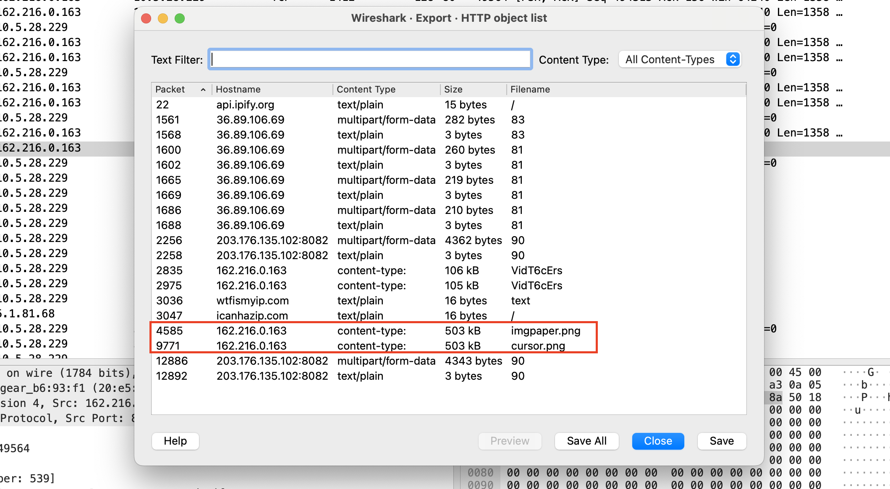
Now, export the 2 EXE files.  

- Once you export the files, navigate to the EXE file through the **Terminal** and run the command: shasum -a 256 *.png to get the SHA256 hashes.  

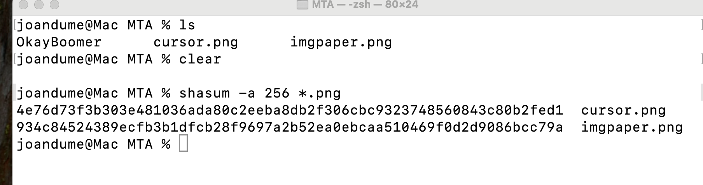

