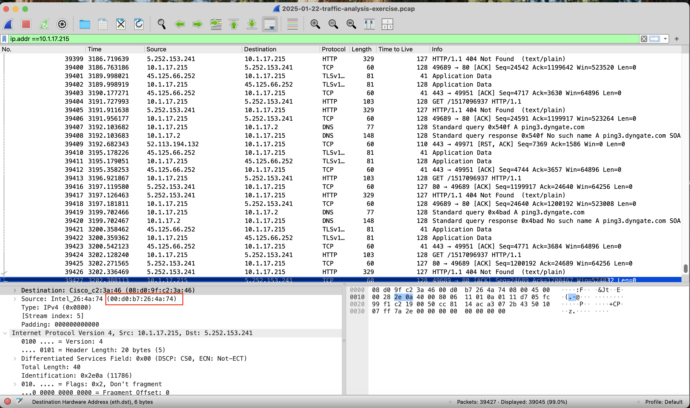

# 2025-01-22 Malware Analysis Exercise
Link to the exercise: https://www.malware-traffic-analysis.net/2025/01/22/index.html

## About
A Malware traffic analysis exercise from a pcap posted on Malware-Traffic-Analysis.net on 2025-01-22.

### Tools Used
Wireshark

## SCENARIO:
* LAN segment range: 10.1.17.0/24 (10.1.17.0 through 10.1.17.255)
* Domain: bluemoontuesday.com
* AD environment name: BLUEMOONTUESDAY
* Domain Controller: 10.1.17.2 – WIN-GSH54QLW48D
* LAN segment gateway: 10.1.17.1
* LAN segment broadcast address: 10.1.17.255

## TASK:
 * The IP Address of the Infected Windows.

