## Malware Traffic Analysis with Wireshark
### About

A Malware traffic analysis exercise from a pcap posted on Malware-Traffic-Analysis.net on 2019-11-12 by Brad Duncan (Unit 42).

### SCENARIO:
- LAN segment range:  10.11.11[.]0/24 (10.11.11[.]0 through 10.11.11[.]255)
- Domain:  okay-boomer[.]info
- Domain controller:  10.11.11[.]11 - Okay-Boomer-DC
- LAN segment gateway:  10.11.11[.]1
- LAN segment broadcast address:  10.11.11[.]255

### QUESTIONS
- What operating system and type of device is on 10.11.11[.]94?
  
Operating System- Chrome OS (CrOS)  
Device - Chromebook  
http.request and ip.addr eq 10.11.11.94  
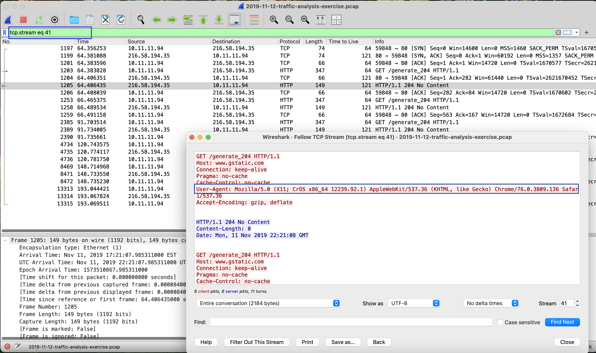

- What operating system and type of device is on 10.11.11[.]121?
  
Operating System - Android 9  
Device - Samsung Galaxy Note 8 (Model: SM-N950U, U.S. variant)  
#http.request and ip.addr eq 10.11.11.121  
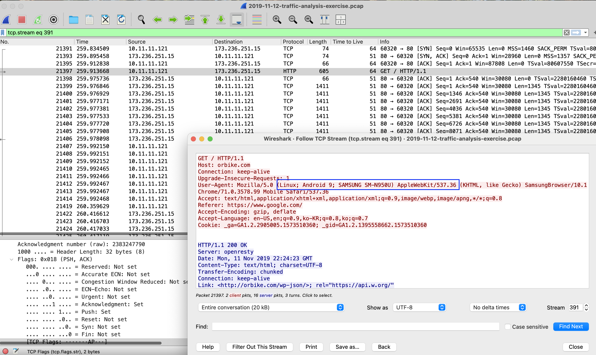

- Based on the MAC address for 10.11.11[.]145, who is the manufacturer or vendor?

Motorola  
#ip.src eq 10.11.11.145  
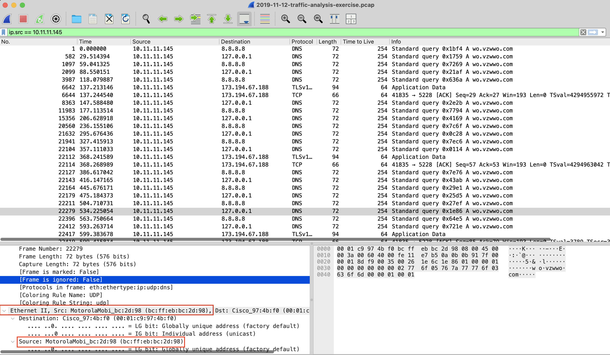

- What operating system and type of device is on 10.11.11[.]179?
Operating System - macOS Catalina (10.15.1)
Device type - Mac computer(Desktop or Macbook)
#http.request and ip.addr eq 10.11.11.179
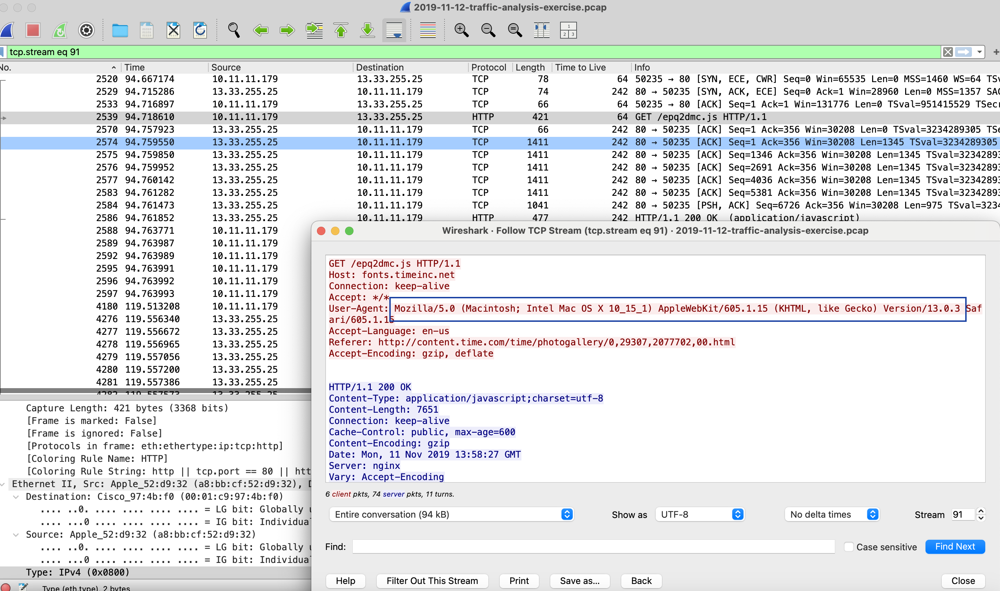

- What version of Windows is being used on the host at 10.11.11[.]195?
Version of Windows - Windows 10 Version 1903
#http.request and ip.addr eq 10.11.11.195
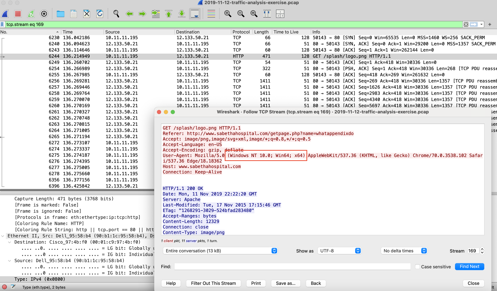
- What is the user account name used to log into the Windows host at 10.11.11[.]200?
brandon.gilbert
#Kerberos.CNameString and ip.addr eq 10.11.11.200
#Add the CNameString Column 
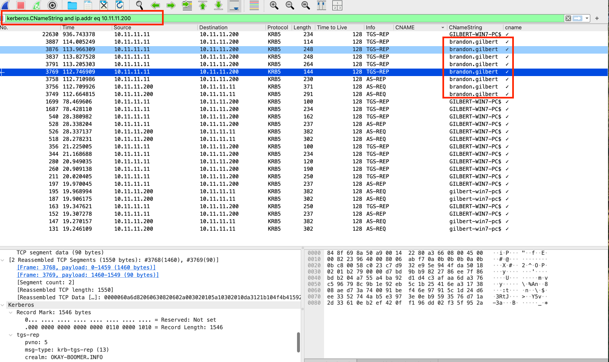

- What operating system and type of device is on 10.11.11[.]217?
Operating System - iPadOS 13.2.2
Device type - Apple iPad

- What IP is the Windows host that downloaded a Windows executable file over HTTP?
10.11.11.203 - http contains "This program"
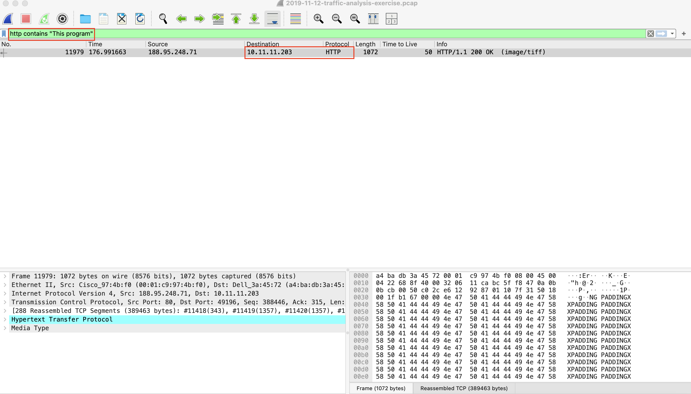
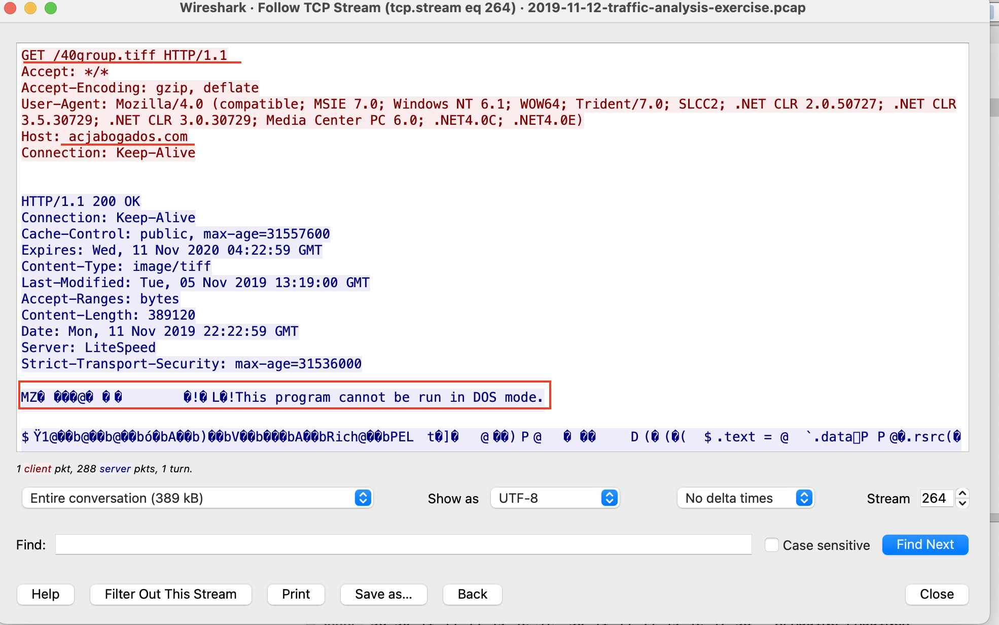

 - What is the URL that returned the Windows executable file?
 http://acjabogados.com/40group.tiff
First two bytes of an EXE or DLL file show as "MZ". This type of line commonly found in EXE or DLL files.
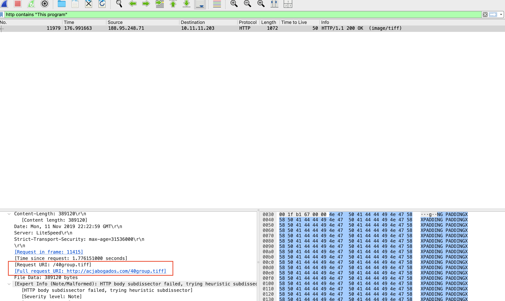

- What is the SHA256 file hash for that Windows executable file?
 8d5d36c8ffb0a9c81b145aa40c1ff3475702fb0b5f9e08e0577bdc405087e635
 Go to File>Export Objects>HTTP and Save the .tiff file.
 Found SHA256 by saving the 40group.tiff file and running the (sha256sum 40group.tiff ) command on MacOS. 
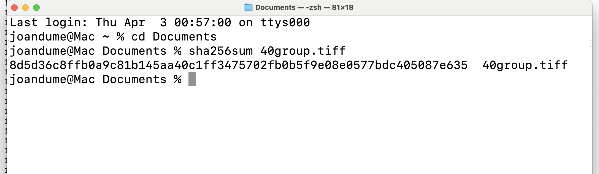

- What is the detection rate for that SHA256 hash on VirusTotal?
62/71
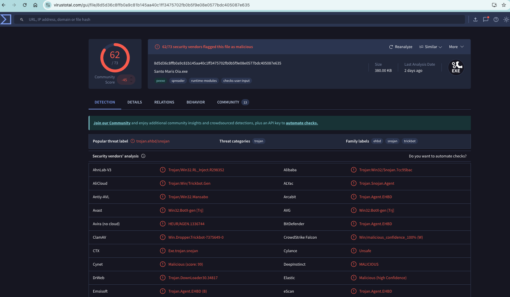

- What public IP addresses did that Windows host attempt to connect over TCP after the executable file was downloaded?
5.188.108.58 and 138.201.6.195
#(http.request or ssl.handshake.type == 1 or tcp.flags eq 0x0002 ) and ! (ssdp) and ip.addr eq 10.11.11.203 and ! (ip.dst eq 10.11.11.11)
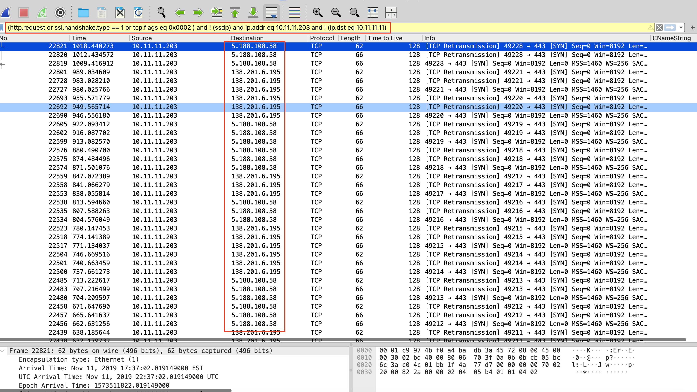

- What is the host name and Windows user account name used on that IP address?
host name: Tucker-Win7-PC , user account name: candice.tucker
#kerberos.CNameString and ip.addr eq 10.11.11.203
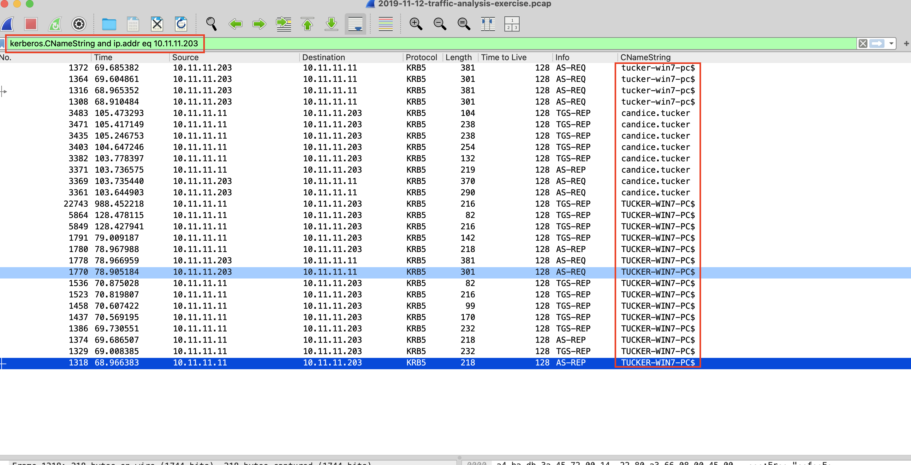
